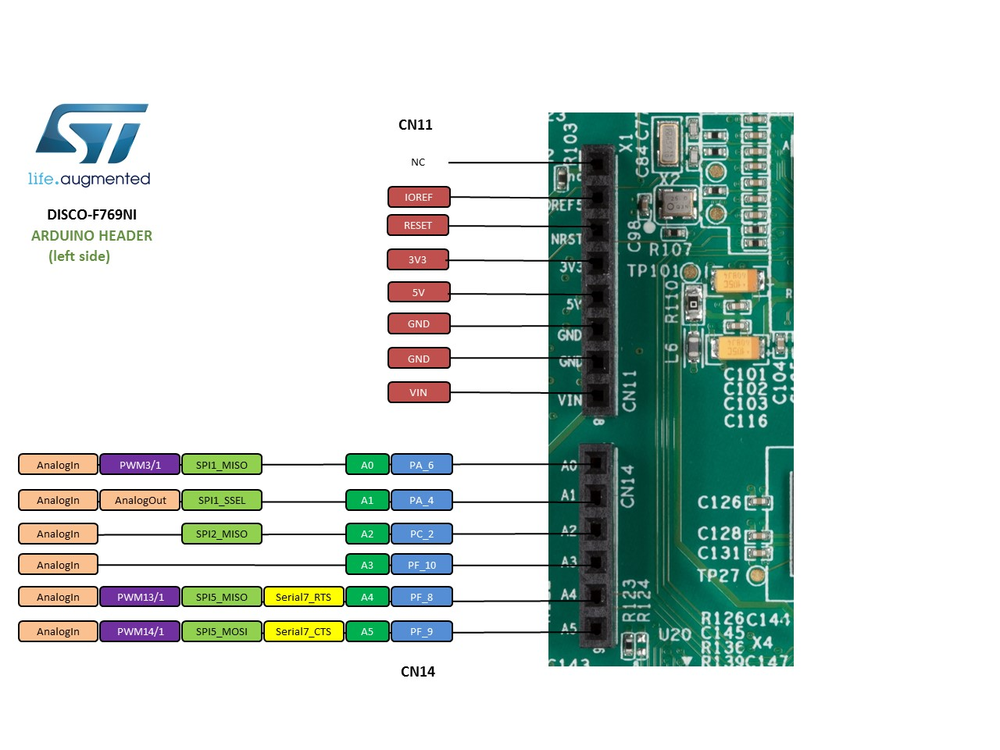
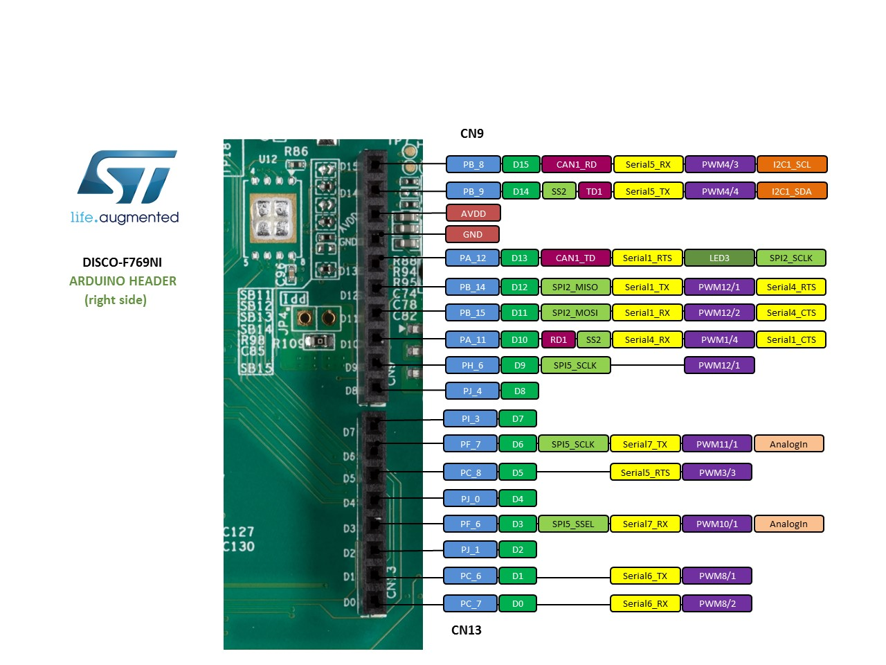

# stm32f769-disco-demo

The STM32F769I-DISCO discovery board is a complete demonstration and development platform providing Ethernet, USB, LCD, audio, and wifi connection.

## 1. Overview

The STM32F7 discovery kit allows users to develop and share applications with the STM32F7 Series microcontrollers based on the ARM®Cortex®-M7 core.

The discovery kit enables a wide diversity of applications taking benefit from audio, multi- sensor support, graphics, security, video and high-speed connectivity features.

The Arduino™connectivity support provides unlimited expansion capabilities with a large choice of specialized add-on boards.

## 2. Microcontroller features

- Core: ARM® 32-bit Cortex®-M7 CPU with DPFPU, ART Accelerator™ and L1-cache: 16 Kbytes I/D cache, allowing 0-wait state execution from embedded Flash and external memories, up to 216 MHz, MPU, 462 DMIPS/2.14 DMIPS/MHz (Dhrystone 2.1), and DSP instructions.
- Memories
    - 2 Mbytes of Flash memory organized into two banks allowing read-while-write
    - SRAM: 512 Kbytes (including 128 Kbytes of data TCM RAM for critical real-time data) + 16 Kbytes of instruction TCM RAM (for critical real-time routines) + 4 Kbytes of backup SRAM
    - Flexible external memory controller with up to 32-bit data bus: SRAM, PSRAM, SDRAM/LPSDR SDRAM, NOR/NAND memories
- Dual mode Quad-SPI
- Graphics
    - Chrom-ART Accelerator™ (DMA2D), graphical hardware accelerator enabling enhanced graphical user interface
    - Hardware JPEG codec
    - LCD-TFT controller supporting up to XGA resolution
    - MIPI® DSI host controller supporting up to 720p 30 Hz resolution
- Clock, reset and supply management
    - 1.7 V to 3.6 V application supply and I/Os
    - POR, PDR, PVD and BOR
    - Dedicated USB power
    - 4-to-26 MHz crystal oscillator
    - Internal 16 MHz factory-trimmed RC (1% accuracy)
    - 32 kHz oscillator for RTC with calibration
    - Internal 32 kHz RC with calibration
- Low-power
    - Sleep, Stop and Standby modes
    - VBAT supply for RTC, 32×32 bit backup registers + 4 Kbytes backup SRAM
- 3×12-bit, 2.4 MSPS ADC: up to 24 channels
- Digital filters for sigma delta modulator (DFSDM), 8 channels / 4 filters
- 2×12-bit D/A converters
- General-purpose DMA: 16-stream DMA controller with FIFOs and burst support
- Up to 18 timers: up to thirteen 16-bit (1x low- power 16-bit timer available in Stop mode) and two 32-bit timers, each with up to 4 IC/OC/PWM or pulse counter and quadrature (incremental) encoder input. All 15 timers running up to 216 MHz. 2x watchdogs, SysTick timer
- Debug mode
    - SWD & JTAG interfaces
    - Cortex®-M7 Trace Macrocell™
- 168 I/O ports with interrupt capability
    - 164 fast I/Os up to 108 MHz
    - 166 5 V-tolerant I/Os
- 28 communication interfaces
    - 4 I2 C interfaces (SMBus/PMBus)
    - 4 USARTs/4 UARTs (12.5 Mbit/s, ISO7816 interface, LIN, IrDA, modem control)
    - 6 SPIs (up to 54 Mbit/s), 3 with muxed simplex I2 S for audio
    - 2 x SAIs (serial audio interface)
    - 3 × CANs (2.0B Active) and 2x SDMMCs
    - SPDIFRX interface
    - HDMI-CEC
    - MDIO slave interface
- Advanced connectivity
    - USB 2.0 full-speed device/host/OTG controller with on-chip PHY
    - USB 2.0 high-speed/full-speed device/host/OTG controller with dedicated DMA, on-chip full-speed PHY and ULPI
    - 10/100 Ethernet MAC with dedicated DMA: supports IEEE 1588v2 hardware, MII/RMII
- 8- to 14-bit camera interface up to 54 Mbyte/s
- True random number generator
- CRC calculation unit
- RTC: subsecond accuracy, hardware calendar
- 96-bit unique ID

## 3. Board features

This discovery board offers everything required for users to get started quickly and develop applications easily. The full range of hardware features on the board helps to evaluate almost all peripherals and develop your own applications.

- STM32F769NIH6 microcontroller featuring 2 Mbytes of Flash memory and 512+16+4 Kbytes of RAM, in BGA216 package
- On-board ST-LINK/V2-1 supporting USB reenumeration capability USB ST-LINK functions: virtual COM port, mass storage, debug port
- 4" capacitive touch LCD display with MIPI® DSI connector (on STM32F769I-DISCO only)
- SAI audio codec
- Two audio line jacks, one for input and one for output
- Stereo speaker outputs
- Four ST MEMS microphones on DFSDM inputs
- Two SPDIF RCA input and output connectors
- Two push-buttons (user and reset)
- 512-Mbit Quad-SPI Flash memory
- 128-Mbit SDRAM
- Connector for microSD card
- Wi-Fi or Ext-EEP daughterboard connector
- USB OTG HS with Micro-AB connector
- Ethernet connector compliant with IEEE-802.3-2002
- Five power supply options:
    - ST LINK/V2-1
    - USB HS connector
    - 5 V from RJ45 (Power Over Ethernet)
    - 5 V from Arduino™ or external connector
    - USB charger
- Power Over Ethernet based on IEEE 802.3af (Powered Device, 48 V to 5 V, 3 W)
- Power supply output for external applications: 3.3 V or 5 V
- **Arduino™ Uno V3 connectors**
- Comprehensive free software including a variety of examples, part of the STM32Cube package
- Supported by a wide choice of integrated development environments

## 4. Board pinout

You can find more details on the available pins and labels in the **PeripheralPins.c** and **PinNames.h** files.

These files can be found in:

- ARMmbed/mbed-os repository on GitHub (**up-to-date** version, used with **mbed CLI commands**)

https://github.com/ARMmbed/mbed-os/blob/master/targets/TARGET_STM/TARGET_STM32F7/TARGET_STM32F769xI/TARGET_DISCO_F769NI/

- mbed-dev library in developer.mbed.org (source files of the mbed library used on **mbed compiler IDE**)

https://developer.mbed.org/users/mbed_official/code/mbed-dev/file/default/targets/TARGET_STM/TARGET_STM32F7/TARGET_STM32F769xI/TARGET_DISCO_F769NI/

